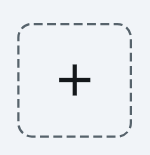

# FlutterFlow Dotted Border Container

A custom widget for FlutterFlow that wraps any child widget with a customizable dotted or dashed border.

FlutterFlow's native Container widget doesn't support dotted/dashed border styles – this widget fills that gap.



## Features

- Fully customizable border color, stroke width, dash pattern, and corner radius
- Accepts any child widget via FlutterFlow's WidgetBuilder
- Uses the popular [dotted_border](https://pub.dev/packages/dotted_border) package
- Production-ready, no hacks

## Parameters

| Parameter | Type | Default | Description |
|-----------|------|---------|-------------|
| `width` | double? | – | Container width |
| `height` | double? | – | Container height |
| `borderColor` | Color? | `#57636C` | Border color |
| `strokeWidth` | double? | `2.0` | Border thickness |
| `dashLength` | double? | `4.0` | Length of each dash |
| `dashGap` | double? | `4.0` | Gap between dashes |
| `borderRadius` | double? | `8.0` | Corner radius |
| `child` | Widget Function()? | – | Child widget |

## Dependencies

Add to your FlutterFlow project:
```
dotted_border: ^3.1.0
```

## Usage

1. Add the dependency in FlutterFlow (Custom Code → Dependencies)
2. Create a new Custom Widget
3. Copy the code from `dotted_border_container.dart`
4. Define the parameters as shown above
5. Use the widget and pass any child widget

## Examples

**Dotted upload area:**
- `dashLength: 4`, `dashGap: 4`, `borderRadius: 8`

**Dashed card border:**
- `dashLength: 8`, `dashGap: 4`, `borderRadius: 12`

**Tight dotted line:**
- `dashLength: 2`, `dashGap: 2`, `borderRadius: 0`

## License

MIT
```

---

**Repo-Struktur:**
```
flutterflow-dotted-border-container/
├── README.md
├── LICENSE
├── dotted_border_container.dart
└── screenshot.png
